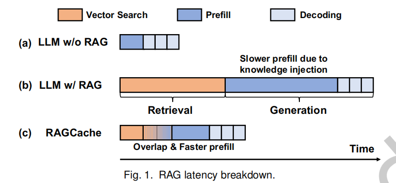
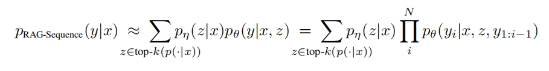
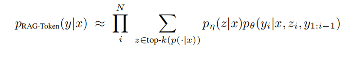
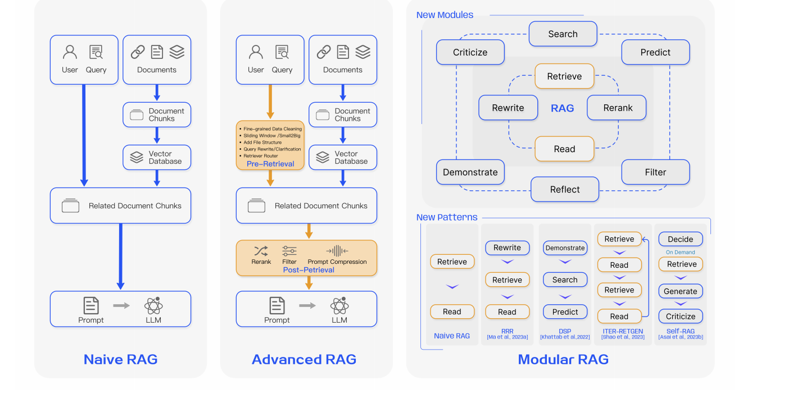

## 1. RAG的流程

首先，从知识数据库中检索相关文档，其中文档通常使用嵌入模型编码为特征向量，并通过向量相似性搜索进行检索。然后，RAG 将检索到的文档
（即外部知识）注入原始请求，并将增强后的请求提供给 LLM 进行生成。借助检索到的文档，RAG 扩展了 LLM 的知识库和上下文理解，从而提
高了生成质量

- **Knowledge Caching：**

RAG-Sequence Model:

RAG-Token Model

RAGCache: Efficient Knowledge Caching for Retrieval-Augmented Generation
我们设计了一个多级动态缓存，该缓存采用前缀感知的 GDSF 替换策略来最小化 LLM 生成时间，
最终的前 k 个文档在检索步骤的早期就出现了。我们使用 MMLU 作为请求数据集，以维基百科作为文档库，将临时搜索结果与最终搜索结果进行比较。当请求到达最终的前 k 个文档时，请求实际上就完成了。图 8 表明，95% 的请求在完成 13% 的搜索过程后就完成了。由于
向量搜索是在 CPU 上处理的，因此，我们可以从临时搜索结果开始生成 LLM，

RAGCache 会缓存跨多个请求检索文档的键值张量，以最大限度地减少冗余计算，并动态地重叠检索和 LLM 生成，以最大限度地降低延迟

PGDSF 根据频率、键值张量的大小、上次访问时间和前缀感知的重新计算成本计算优先级。缓存驱逐由优先级决定，确保保留最有价值的张量。

